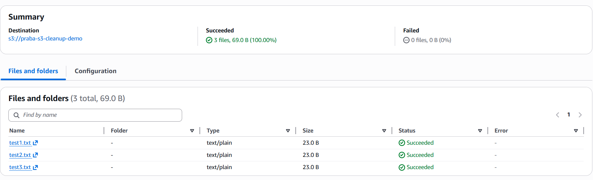
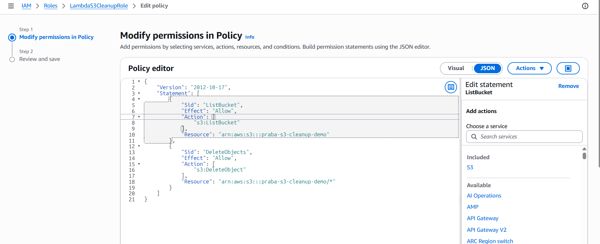
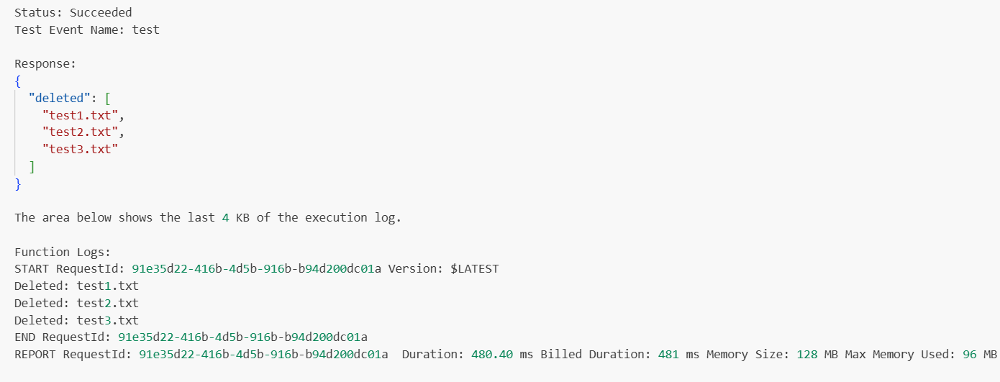
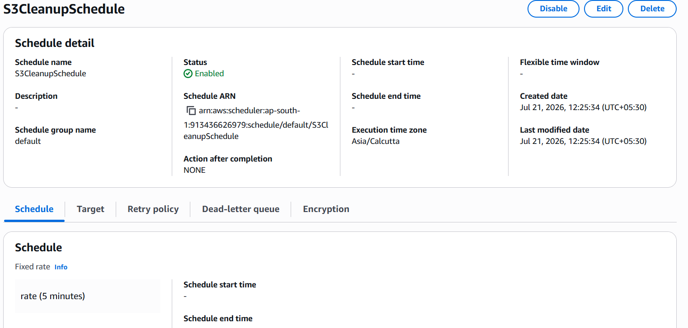
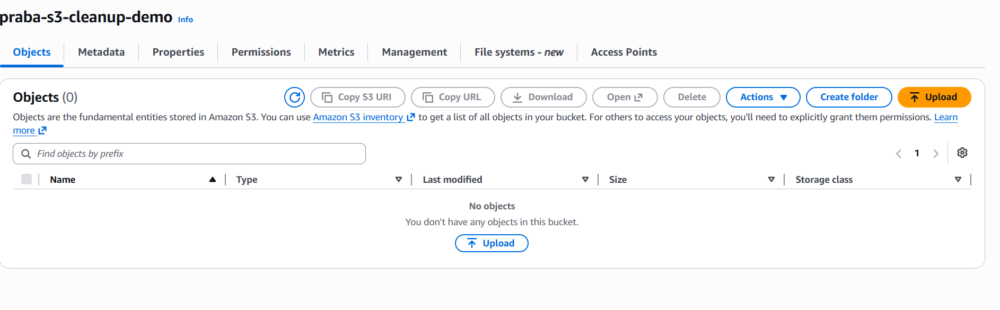

# AWS Automation with Lambda & Boto3

# Assignment 1: Automated S3 Bucket Cleanup (Objects Older Than 30 Days)

**AWS Region:** Asia Pacific (Mumbai) -- `ap-south-1`

------------------------------------------------------------------------

# Objective

Automate the deletion of stale objects from an Amazon S3 bucket using
AWS Lambda and Boto3. The Lambda function scans the bucket, identifies
objects older than the configured retention period, deletes them, and
records the execution in Amazon CloudWatch Logs.

------------------------------------------------------------------------

# AWS Services Used

-   Amazon S3
-   AWS Lambda
-   AWS IAM
-   Amazon EventBridge Scheduler
-   Amazon CloudWatch
-   Python 3.12
-   Boto3

------------------------------------------------------------------------

# Architecture

``` text
Amazon EventBridge Scheduler
            |
            v
     AWS Lambda (Python 3.12)
            |
        Boto3 SDK
            |
            v
      Amazon S3 Bucket
            |
Delete objects older than retention period
            |
            v
     Amazon CloudWatch Logs
```

------------------------------------------------------------------------

# Implementation Steps

## Step 1 -- Create S3 Bucket

Created bucket:

`praba-s3-cleanup-demo`

Uploaded files:

-   test1.txt
-   test2.txt
-   test3.txt

> **📸 Screenshot 1:** Replace with **S3 Bucket Before Cleanup**

------------------------------------------------------------------------

## Step 2 -- Create IAM Role

Created IAM Role:

`LambdaS3CleanupRole`

Added least-privilege inline policy:

-   `s3:ListBucket`
-   `s3:DeleteObject`

> **📸 Screenshot 2:** Replace with **IAM Role & Inline Policy**
Assignment-1-S3-Cleanup/screenshot/02-IAM-Role.png.png
------------------------------------------------------------------------

## Step 3 -- Create Lambda Function

Configuration:

  Property         Value
  ---------------- ---------------------
  Function Name    S3CleanupFunction
  Runtime          Python 3.12
  Region           ap-south-1
  Execution Role   LambdaS3CleanupRole

> **📸 Screenshot 3:** Replace with **Lambda Configuration**

------------------------------------------------------------------------

## Step 4 -- Lambda Logic

The Lambda function:

1.  Lists all objects using an S3 paginator.
2.  Compares `LastModified` with the current UTC time.
3.  Deletes objects older than the configured threshold.
4.  Logs deleted object names to CloudWatch.

**Testing:** The age threshold was temporarily set to **1 minute**.

**Production:**

``` python
AGE_LIMIT = timedelta(days=30)
```

------------------------------------------------------------------------

# Testing

Manual Lambda execution result:

**Status:** `Succeeded`

Output:

``` json
{
  "deleted": [
    "test1.txt",
    "test2.txt",
    "test3.txt"
  ]
}
```

> **📸 Screenshot 4:** Replace with **Lambda Test Output**

------------------------------------------------------------------------

# EventBridge Scheduler

  Property        Value
  --------------- ---------------------------
  Schedule Name   S3CleanupSchedule
  Type            Recurring
  Rate            Every 5 minutes (Testing)
  Target          S3CleanupFunction
  State           Enabled

> **📸 Screenshot 5:** Replace with **EventBridge Scheduler**

------------------------------------------------------------------------

# Final Result

-   Lambda executed successfully.
-   Objects older than the threshold were deleted.
-   CloudWatch captured execution logs.
-   EventBridge Scheduler can invoke the function automatically.

> **📸 Screenshot 7:** Replace with **S3 Bucket After Cleanup**

------------------------------------------------------------------------

# Discussion

Amazon S3 Lifecycle Rules are the preferred native solution for simple
age-based object deletion because they are fully managed and require no
code.

AWS Lambda is preferred when deletion depends on: - Object naming
patterns - Metadata checks - Cross-service integrations -
Notifications - Custom business logic

------------------------------------------------------------------------

# Best Practices

-   Python 3.12 runtime
-   Least-privilege IAM permissions
-   S3 paginator
-   Timezone-aware datetime comparison
-   CloudWatch logging
-   EventBridge Scheduler automation

------------------------------------------------------------------------

# GitHub Repository Structure

``` text
Assignment-1-S3-Cleanup/
│
├── lambda_function.py
├── README.md
├── Assignment-1-Documentation.md
└── screenshots/
    ├── 01-S3-Bucket.png
    ├── 02-IAM-Role.png
    ├── 03-Lambda-Configuration.png
    ├── 04-Lambda-Test.png
    ├── 05-EventBridge.png
    └── 06-Final-Result.png
```

------------------------------------------------------------------------

# Conclusion

The assignment was completed successfully. AWS Lambda automated S3
object cleanup using Boto3, EventBridge Scheduler handled recurring
execution, IAM followed least-privilege principles, and CloudWatch
provided centralized logging.
