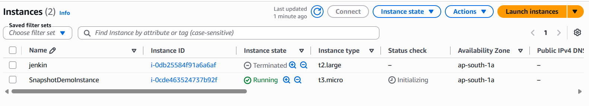

# AWS Automation with Lambda & Boto3

# Assignment 2: Automated EBS Snapshot Creation and Cleanup

**Student Name:** Prabakaran P

**AWS Region:** Asia Pacific (Mumbai) - `ap-south-1`

---

# Objective

The objective of this assignment is to automate the creation of Amazon EBS snapshots using AWS Lambda and Boto3. The solution also deletes snapshots older than the configured retention period and records all operations in Amazon CloudWatch Logs.

---

# AWS Services Used

- Amazon EC2
- Amazon EBS
- AWS Lambda
- AWS IAM
- Amazon EventBridge Scheduler
- Amazon CloudWatch
- Python 3.12
- Boto3

---

# Architecture

```text
          EventBridge Scheduler
                  │
                  ▼
         AWS Lambda (Python 3.12)
                  │
                Boto3
                  │
        ┌─────────┴─────────┐
        ▼                   ▼
 Create EBS Snapshot   Delete Old Snapshots
        │                   │
        └─────────┬─────────┘
                  ▼
          CloudWatch Logs
```

---

# Implementation Steps

## Step 1 – Create EC2 Instance

Created an EC2 instance using:

| Property | Value |
|----------|-------|
| Instance Type | t3.micro |
| AMI | Amazon Linux 2023 |
| Region | ap-south-1 |

Captured the EBS Volume ID attached to the instance.

> 📸 **Screenshot 1:** EC2 Instance Running

---

## Step 2 – Identify EBS Volume

Retrieved the attached EBS volume from the EC2 console.

Example:

```text
Volume ID:
vol-xxxxxxxxxxxxxxxxx
```

> 📸 **Screenshot 2:** EBS Volume Details

---

## Step 3 – Create IAM Role

Created IAM Role:

```text
LambdaEBSSnapshotRole
```

Permissions granted:

- ec2:CreateSnapshot
- ec2:DescribeSnapshots
- ec2:DeleteSnapshot
- ec2:CreateTags
- ec2:DescribeVolumes

Also attached:

- AWSLambdaBasicExecutionRole

> 📸 **Screenshot 3:** IAM Role & Policies

---

## Step 4 – Create Lambda Function

Configuration

| Property | Value |
|----------|-------|
| Function Name | EBSSnapshotManager |
| Runtime | Python 3.12 |
| Region | ap-south-1 |
| Execution Role | LambdaEBSSnapshotRole |

> 📸 **Screenshot 4:** Lambda Configuration

---

## Step 5 – Lambda Function Logic

The Lambda function performs the following operations:

1. Creates a snapshot of the specified EBS volume.
2. Tags the snapshot using:

```text
CreatedBy = Lambda-Backup
```

3. Retrieves snapshots created by Lambda.
4. Compares snapshot creation time with the current UTC time.
5. Deletes snapshots older than the configured retention period.
6. Logs all created and deleted snapshot IDs in CloudWatch.

For testing, the retention period was temporarily changed to **1 minute**.

Before production deployment:

```python
RETENTION = timedelta(days=30)
```

---

# Testing

The Lambda function was manually executed using the AWS Console.

Execution Status

```text
Succeeded
```

Example Output

```json
{
    "CreatedSnapshot": "snap-xxxxxxxxxxxxxxxx",
    "DeletedSnapshots": []
}
```

After waiting for the configured retention period, older snapshots were deleted successfully.

> 📸 **Screenshot 5:** Lambda Test Output

---

# Snapshot Verification

Verified snapshot creation in the EC2 Console.

Snapshot Tag

```text
CreatedBy = Lambda-Backup
```

> 📸 **Screenshot 6:** Snapshot List

---

# EventBridge Scheduler

Configured EventBridge Scheduler to automatically execute the Lambda function.

| Property | Value |
|----------|-------|
| Schedule Name | WeeklySnapshotSchedule |
| Schedule Type | Recurring |
| Rate | Every 5 minutes (Testing) |
| Target | EBSSnapshotManager |
| State | Enabled |

For production, the schedule can be updated to execute weekly.

> 📸 **Screenshot 7:** EventBridge Scheduler

---

# CloudWatch Logs

CloudWatch automatically records Lambda execution.

Example

```text
START RequestId...

Created Snapshot:
snap-xxxxxxxx

Deleted Snapshot:
snap-yyyyyyyy

END RequestId...

REPORT RequestId...
```

> 📸 **Screenshot 8:** CloudWatch Logs

---

# Final Result

Successfully implemented:

- Automatic EBS Snapshot Creation
- Snapshot Tagging
- Snapshot Cleanup
- EventBridge Automation
- CloudWatch Logging

---

# Discussion

AWS Data Lifecycle Manager (DLM) is the preferred managed service for scheduling EBS snapshots and retention because it requires no custom code and automatically manages backup policies.

AWS Lambda is a better choice when custom business logic is required, such as conditional retention rules, cross-account snapshot copying, automated notifications, or integration with external systems.

---

# Best Practices Followed

- Python 3.12 runtime
- Principle of Least Privilege (IAM)
- Snapshot tagging
- CloudWatch logging
- EventBridge Scheduler automation
- Tested using a short retention period before switching to 30 days

---

# GitHub Repository Structure

```text
Assignment-2-EBS-Snapshot/
│
├── lambda_function.py
├── README.md
├── Assignment-2-Documentation.md
└── screenshots/
    ├── 01-EC2-Instance.png
    ├── 02-EBS-Volume.png
    ├── 03-IAM-Role.png
    ├── 04-Lambda-Configuration.png
    ├── 05-Lambda-Test.png
    ├── 06-Snapshot-List.png
    ├── 07-EventBridge.png
    └── 08-CloudWatch-Logs.png
```

---

# Submission Checklist

- ✅ Python Code
- ✅ GitHub Repository
- ✅ IAM Role Screenshot
- ✅ Lambda Configuration Screenshot
- ✅ Lambda Test Output
- ✅ Snapshot Verification
- ✅ EventBridge Scheduler
- ✅ CloudWatch Logs
- ✅ Documentation

---

# Conclusion

This assignment successfully automated Amazon EBS snapshot creation and cleanup using AWS Lambda and Boto3. The solution follows AWS best practices by implementing least-privilege IAM permissions, automated scheduling through EventBridge Scheduler, and centralized logging with CloudWatch. The workflow was tested successfully, confirming automatic snapshot creation, tagging, cleanup, and logging.