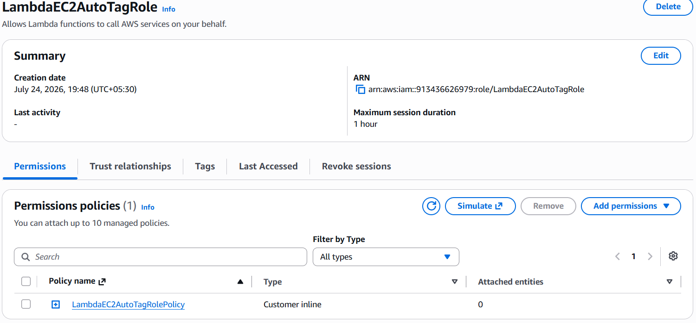
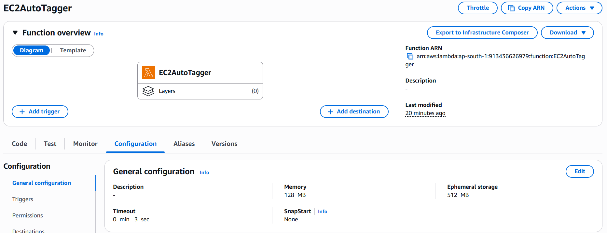
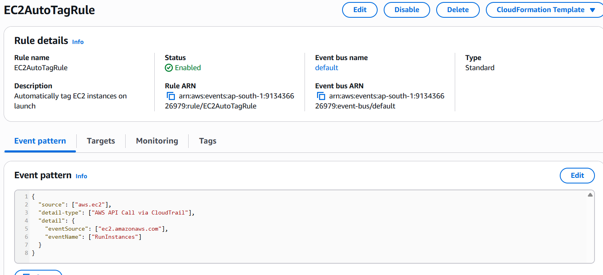
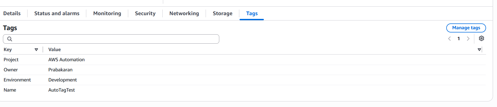
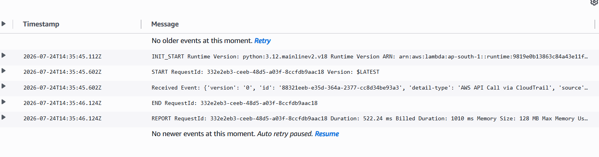

# AWS Automation with Lambda & Boto3

# Assignment 3: Auto-Tagging EC2 Instances on Launch

**Student Name:** Prabakaran P

**AWS Region:** Asia Pacific (Mumbai) - `ap-south-1`

---

# Objective

The objective of this assignment is to automatically tag newly launched Amazon EC2 instances using AWS Lambda, Amazon EventBridge, and Boto3. Whenever an EC2 instance is created, EventBridge detects the launch event and invokes a Lambda function that adds predefined tags to the instance.

---

# AWS Services Used

- Amazon EC2
- AWS Lambda
- Amazon EventBridge
- AWS IAM
- Amazon CloudWatch
- Python 3.12
- Boto3

---

# Architecture

```text
             Launch EC2 Instance
                     │
                     ▼
        CloudTrail Records API Event
                     │
                     ▼
          Amazon EventBridge Rule
                     │
                     ▼
          AWS Lambda (EC2AutoTagger)
                     │
                     ▼
          Add Tags to EC2 Instance
                     │
                     ▼
             Amazon CloudWatch Logs
```

---

# Implementation Steps

## Step 1 – Create IAM Role

Created an IAM Role for Lambda.

**Role Name**

```text
LambdaEC2AutoTagRole
```

Attached Permissions:

### Managed Policy

```text
AWSLambdaBasicExecutionRole
```

### Inline Policy

```json
{
  "Version": "2012-10-17",
  "Statement": [
    {
      "Sid": "TagEC2",
      "Effect": "Allow",
      "Action": [
        "ec2:CreateTags",
        "ec2:DescribeInstances"
      ],
      "Resource": "*"
    }
  ]
}
```

**Screenshot:** `01-IAM-Role.png`

---

## Step 2 – Create Lambda Function

Created a Lambda function.

| Property | Value |
|----------|-------|
| Function Name | EC2AutoTagger |
| Runtime | Python 3.12 |
| Region | ap-south-1 |
| Execution Role | LambdaEC2AutoTagRole |

**Screenshot:** `02-Lambda-Configuration.png`

---

## Step 3 – Lambda Function

The Lambda function performs the following actions:

- Receives the EC2 launch event from EventBridge.
- Extracts the EC2 Instance ID.
- Automatically adds predefined tags.
- Logs execution details to CloudWatch.

Tags added:

| Key | Value |
|-----|-------|
| Environment | Development |
| Owner | Prabakaran |
| Project | AWS Automation |

---

## Step 4 – Create EventBridge Rule

Created a standard EventBridge rule.

| Property | Value |
|----------|-------|
| Rule Name | EC2AutoTagRule |
| Event Bus | default |
| Rule Status | Enabled |

### Event Pattern

```json
{
  "source": ["aws.ec2"],
  "detail-type": ["AWS API Call via CloudTrail"],
  "detail": {
    "eventSource": ["ec2.amazonaws.com"],
    "eventName": ["RunInstances"]
  }
}
```

Target:

```text
Lambda Function → EC2AutoTagger
```

**Screenshot:** `03-EventBridge-Rule.png`

---

## Step 5 – Test the Solution

Launched a new EC2 instance.

Instance Name

```text
AutoTagTest
```

After a few seconds, EventBridge invoked the Lambda function automatically.

The Lambda successfully tagged the EC2 instance.

---

# Verification

Verified the tags from the EC2 Console.

| Tag Key | Tag Value |
|---------|-----------|
| Name | AutoTagTest |
| Environment | Development |
| Owner | Prabakaran |
| Project | AWS Automation |

**Result:** Automatic tagging completed successfully.

**Screenshot:** `04-EC2-Tags.png`

---

# CloudWatch Logs

Verified Lambda execution logs.

Log Group

```text
/aws/lambda/EC2AutoTagger
```

Example Log

```text
START RequestId: xxxxxxxxx

Received Event:
{
    ...
}

Successfully tagged instance:
i-xxxxxxxxxxxxxxxx

END RequestId: xxxxxxxxx

REPORT RequestId: xxxxxxxxx
```

**Screenshot:** `05-CloudWatch-Logs.png`

---

# Final Result

Successfully implemented:

- Automatic EC2 instance detection
- Automatic tagging using Lambda
- Event-driven architecture with EventBridge
- CloudWatch logging
- Least privilege IAM permissions

---

# Discussion

### Why use EventBridge instead of polling EC2?

Amazon EventBridge provides an event-driven architecture that invokes AWS Lambda immediately after an EC2 instance is launched. This eliminates continuous polling, reduces API calls and operational costs, and provides near real-time automation.

---

# Best Practices Followed

- Principle of Least Privilege (IAM)
- Event-driven architecture
- AWS Lambda automation
- CloudWatch logging
- Reusable tagging strategy
- Serverless implementation

---

# GitHub Repository Structure

```text
Assignment-3-EC2-AutoTagging/
│
├── lambda_function.py
├── README.md
└── screenshots/
    ├── 01-IAM-Role.png
    ├── 02-Lambda-Configuration.png
    ├── 03-EventBridge-Rule.png
    ├── 04-EC2-Tags.png
    └── 05-CloudWatch-Logs.png
```

---

# Submission Checklist

- ✅ Lambda Function
- ✅ IAM Role
- ✅ EventBridge Rule
- ✅ Event Pattern
- ✅ EC2 Instance
- ✅ Automatic Tags
- ✅ CloudWatch Logs
- ✅ GitHub Repository
- ✅ Documentation

---

# Conclusion

This assignment successfully automated Amazon EC2 instance tagging using AWS Lambda, Amazon EventBridge, and Boto3. The solution detects new EC2 launch events in real time, automatically applies predefined tags, and records execution details in Amazon CloudWatch Logs. The implementation follows AWS best practices by using least-privilege IAM permissions and an event-driven serverless architecture.