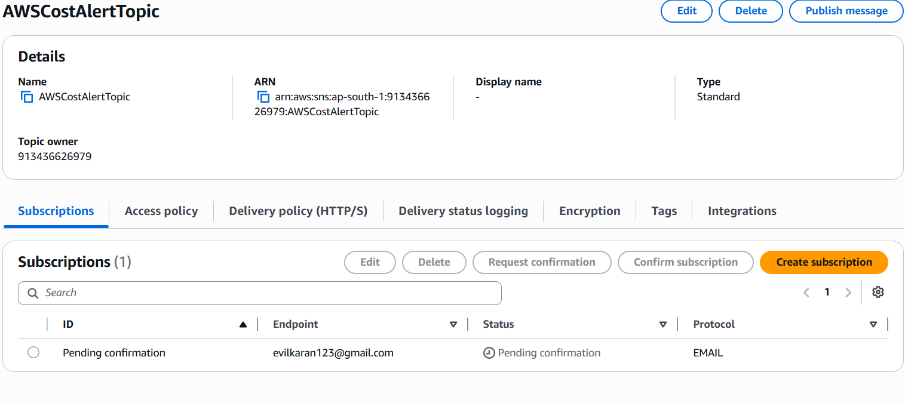
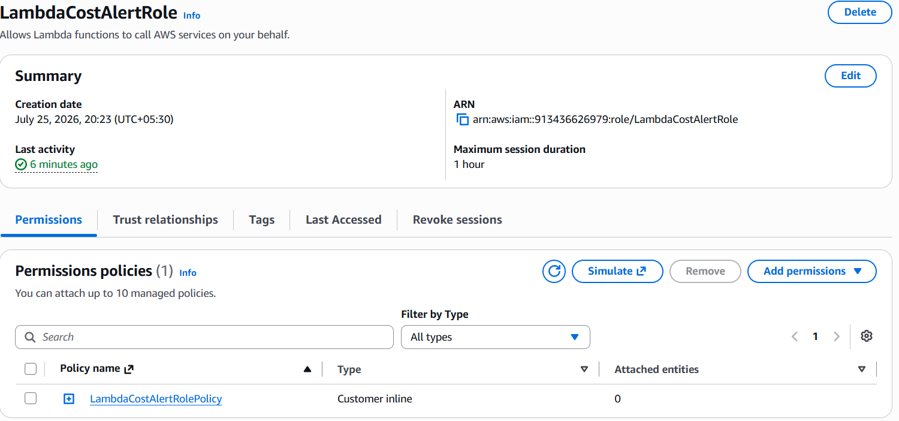
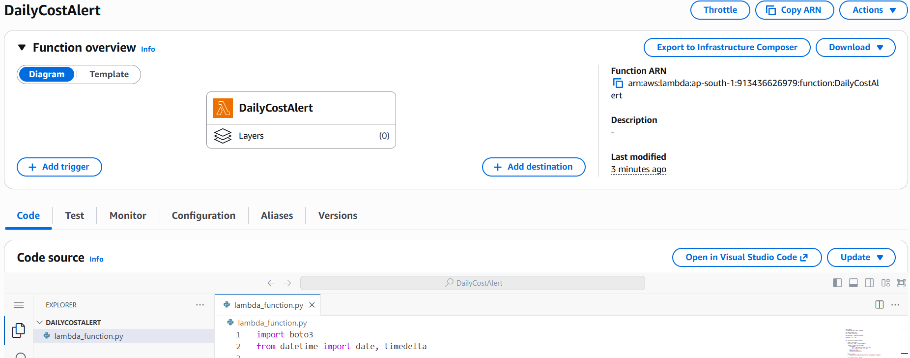
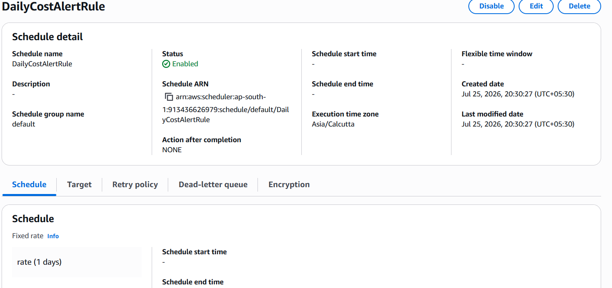
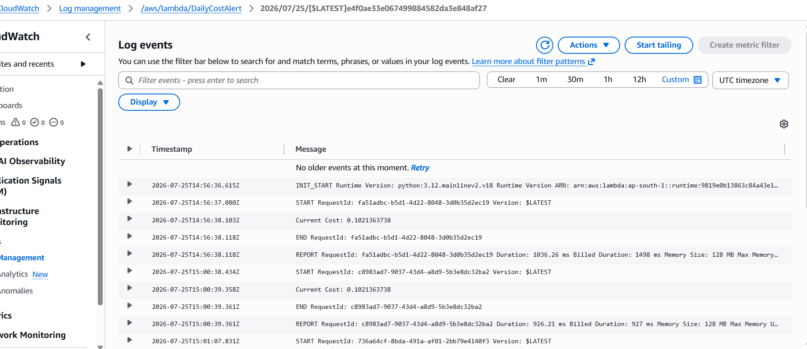
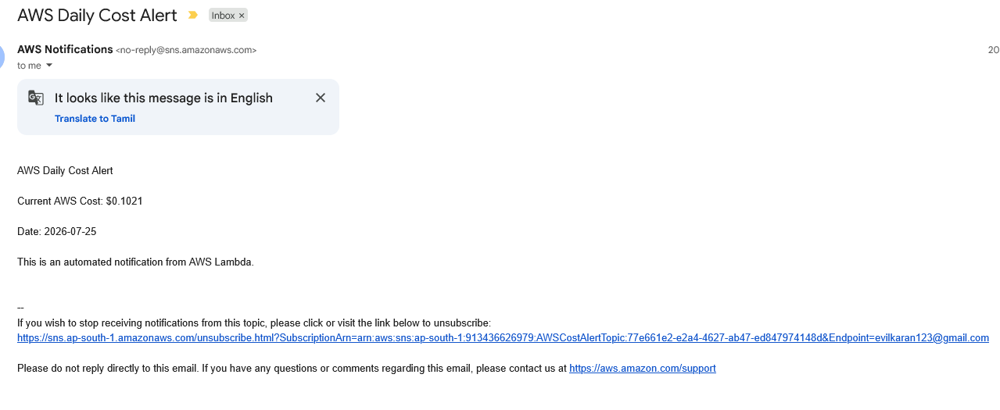

# AWS Automation with Lambda & Boto3

# Assignment 4: Daily AWS Cost Alert Using Cost Explorer API and Amazon SNS

**Student Name:** Prabakaran P

**AWS Region:** Asia Pacific (Mumbai) - `ap-south-1`

---

# Objective

The objective of this assignment is to automate daily AWS cost monitoring using AWS Lambda, Amazon EventBridge Scheduler, AWS Cost Explorer API, and Amazon SNS. The Lambda function retrieves the previous day's AWS cost from Cost Explorer and sends an email notification containing the current cost. The function is executed automatically every day using Amazon EventBridge Scheduler.

---

# AWS Services Used

- AWS Lambda
- Amazon EventBridge Scheduler
- AWS Cost Explorer API
- Amazon SNS
- AWS IAM
- Amazon CloudWatch Logs
- Python 3.12
- Boto3

---

# Architecture

```text
                Amazon EventBridge Scheduler
                     (Runs Every Day)
                            │
                            ▼
                  AWS Lambda (DailyCostAlert)
                            │
                            ▼
                 AWS Cost Explorer API
                            │
                            ▼
              Retrieve Previous Day AWS Cost
                            │
                            ▼
                   Amazon SNS Topic
                            │
                            ▼
                  Email Notification Sent
                            │
                            ▼
                  Amazon CloudWatch Logs
```

---

# Implementation Steps

## Step 1 – Enable AWS Cost Explorer

Enabled AWS Cost Explorer from the AWS Billing Console.

Navigation:

```text
Billing & Cost Management
        ↓
Cost Explorer
        ↓
Enable Cost Explorer
```

> Note: Cost Explorer must be enabled before using the Cost Explorer API.


---

## Step 2 – Create SNS Topic

Created an SNS Topic to send daily AWS cost notifications.

| Property | Value |
|----------|-------|
| Topic Name | AWSCostAlertTopic |
| Type | Standard |

Navigation:

```text
Amazon SNS
      ↓
Topics
      ↓
Create Topic
```


---

## Step 3 – Create Email Subscription

Created an email subscription for the SNS topic.

| Property | Value |
|----------|-------|
| Protocol | Email |
| Endpoint | evilkaran123@gmail.com |
| Status | Confirmed |

Navigation:

```text
Amazon SNS
      ↓
Subscriptions
      ↓
Create Subscription
```

The confirmation email was accepted to activate the subscription.

**Screenshot:** `01-SNS-Subscription.png`

---

## Step 4 – Create IAM Role

Created an IAM Role for the Lambda function.

**Role Name**

```text
LambdaCostAlertRole
```

Attached Managed Policy

```text
AWSLambdaBasicExecutionRole
```

Inline Policy

```json
{
  "Version": "2012-10-17",
  "Statement": [
    {
      "Sid": "CostExplorerAccess",
      "Effect": "Allow",
      "Action": [
        "ce:GetCostAndUsage"
      ],
      "Resource": "*"
    },
    {
      "Sid": "SNSPublishAccess",
      "Effect": "Allow",
      "Action": [
        "sns:Publish"
      ],
      "Resource": "*"
    },
    {
      "Sid": "CloudWatchLogsAccess",
      "Effect": "Allow",
      "Action": [
        "logs:CreateLogGroup",
        "logs:CreateLogStream",
        "logs:PutLogEvents"
      ],
      "Resource": "*"
    }
  ]
}
```

**Screenshot:** `02-IAM-Role.png`

---

## Step 5 – Create Lambda Function

Created a Lambda function to retrieve AWS costs and send email notifications.

| Property | Value |
|----------|-------|
| Function Name | DailyCostAlert |
| Runtime | Python 3.12 |
| Region | ap-south-1 |
| Execution Role | LambdaCostAlertRole |

**Screenshot:** `03-Lambda-Configuration.png`

---

## Step 6 – Lambda Function Workflow

The Lambda function performs the following operations:

- Connects to AWS Cost Explorer.
- Retrieves the previous day's AWS cost.
- Publishes an email message to Amazon SNS.
- Writes execution logs to Amazon CloudWatch.

Sample Output

```text
Current AWS Cost: $0.1021
SNS Message Sent Successfully
```

---

## Step 7 – Create EventBridge Scheduler

Created an EventBridge Scheduler to execute the Lambda function once every day.

| Property | Value |
|----------|-------|
| Schedule Name | DailyCostAlertRule |
| Schedule Type | Recurring |
| Time Zone | Asia/Calcutta |
| Schedule Expression | rate(1 days) |
| Target | DailyCostAlert Lambda |

Navigation

```text
Amazon EventBridge Scheduler
        ↓
Create Schedule
```

**Screenshot:** `04-EventBridge-Scheduler.png`

---

## Step 8 – Test the Solution

Executed the Lambda function manually using a test event.

```json
{}
```

The Lambda successfully:

- Retrieved the AWS daily cost.
- Published a notification to the SNS topic.
- Logged execution details to CloudWatch.

---

# CloudWatch Verification

Verified Lambda execution logs.

Log Group

```text
/aws/lambda/DailyCostAlert
```

Example Output

```text
START RequestId: fa51adbc-b5d1-4d22-8048-3d0b35d2ec19

Current Cost: 0.1021363738

SNS Message Sent Successfully

END RequestId: fa51adbc-b5d1-4d22-8048-3d0b35d2ec19

REPORT RequestId: fa51adbc-b5d1-4d22-8048-3d0b35d2ec19
```

**Screenshot:** `07-CloudWatch-Logs.png`

---

# Email Notification

Amazon SNS sends an email containing the AWS daily cost.

Example Email

```text
Subject:
AWS Daily Cost Report

Body:

AWS Daily Cost Report

Current AWS Cost: $0.1021

This is an automated daily AWS cost report generated by AWS Lambda.
```

**Screenshot:** `08-Email-Notification.png`

---

# Verification Results

| Component | Status |
|-----------|--------|
| Cost Explorer Enabled | ✅ |
| SNS Topic Created | ✅ |
| Email Subscription Confirmed | ✅ |
| IAM Role Created | ✅ |
| Lambda Function Created | ✅ |
| EventBridge Scheduler Created | ✅ |
| CloudWatch Logs Generated | ✅ |
| Email Notification Sent | ✅ |

---

# Benefits

- Fully automated daily AWS cost monitoring.
- Event-driven serverless architecture.
- Real-time cost reporting via email.
- CloudWatch logging for monitoring and troubleshooting.
- No server management required.

---

# Best Practices Followed

- Least Privilege IAM Policy
- Serverless Architecture
- Event-Driven Automation
- CloudWatch Logging
- Amazon SNS Notifications
- Cost Monitoring Automation

---

# GitHub Repository Structure

```text
Assignment-4-Daily-AWS-Cost-Alert/
│
├── lambda_function.py
├── README.md
└── screenshots/
    ├── 01-SNS-Topic.png    
    ├── 02-IAM-Role.png
    ├── 03-Lambda-Configuration.png
    ├── 04-EventBridge-Scheduler.png
    ├── 05-CloudWatch-Logs.png
    └── 06-Email-Notification.png
```

---

# Submission Checklist

- ✅ AWS Cost Explorer Enabled
- ✅ SNS Topic Created
- ✅ Email Subscription Confirmed
- ✅ IAM Role Configured
- ✅ Lambda Function Developed
- ✅ EventBridge Scheduler Configured
- ✅ CloudWatch Logs Verified
- ✅ Email Notification Verified
- ✅ GitHub Repository
- ✅ Documentation

---

# Conclusion

This assignment successfully automated AWS cost monitoring using AWS Lambda, Amazon EventBridge Scheduler, AWS Cost Explorer API, and Amazon SNS. The solution retrieves the previous day's AWS cost on a daily schedule, sends an email notification through Amazon SNS, and records execution details in Amazon CloudWatch Logs. The implementation follows AWS best practices by using an event-driven, serverless architecture with least-privilege IAM permissions, providing a scalable and efficient approach to monitoring AWS costs.